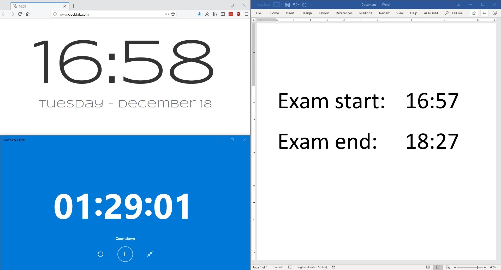

# Exam clock

**This utility is in development!**

This is supposed to be a little JavaScript utility that displays:
- a clock with the current date and time, as reported on the local machine that runs this code;
- a countdown timer for a user-input amount of minutes;
- the time when the timer has been started;
- the time when the timer will stop.

I am writing this because sometimes I proctor exams.
When I do, I happen to set up a projector in the room with the following screen:



It is tedious to set it up everytime and it requires brain power to calculate the ending time (especially for exams that last 45, 75, etc. minutes).
Also, I do not particularly love the layout: the clock should occupy the upper half of the screen, while the countdown and the static info panel should share the lower half of the screen, especially on screens whose aspect ratio is 4:3.

This project (_finally_) gives me a bit of motivation to learn a bit of HTML, JavaScript and CSS.


## Disclaimers

You can use this code, see the [license](./LICENSE).
However, a downside of the [MIT license](https://en.wikipedia.org/wiki/MIT_License) is that I will not be responsible if you rely on this, especially for mission-critical jobs:

``` THE SOFTWARE IS PROVIDED "AS IS", WITHOUT WARRANTY OF ANY KIND ```

Hence, you are encouraged to review the code before you use it.
If you have suggestions or improvements, I welcome pull requests.
